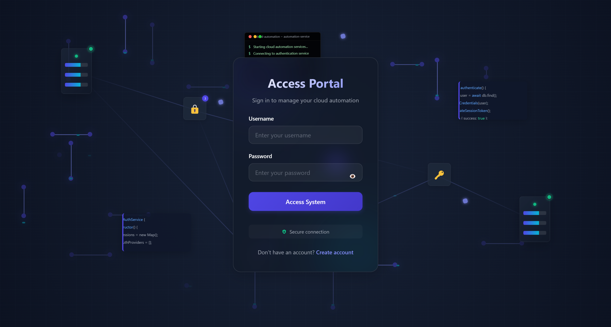
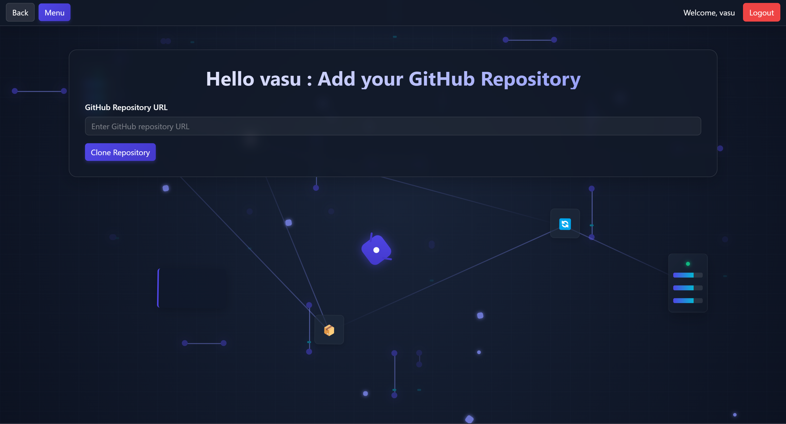

# InstantHost

**InstantHost** is an AI-driven cloud deployment automation solution designed to simplify the process of hosting websites or applications on the cloud. By leveraging modern technologies such as Python, JavaScript, Flask, Terraform, and AWS services, InstantHost eliminates manual setup steps and reduces deployment time by **80%**.

## Key Features

1. **GitHub Integration**: Users can deploy websites directly by providing a GitHub URL and minimal site details.
2. **Automated Deployment**:
   - Automatically provisions required resources such as ECS Clusters, ECR Registries, Load Balancers, Security Groups, IAM Roles, and more.
   - Deploys projects within **7–10 minutes**, providing the user with a load balancer URL for immediate access.
3. **Auto-Scaling and Load Balancing**: Ensures peak operational efficiency and consistent availability.
4. **Infrastructure as Code (IaC)**: Uses Terraform to automate cloud resource provisioning with zero manual intervention.
5. **One-Click Resource Cleanup**:
   - If users wish to delete all the resources associated with the deployment, they can simply click the **"Destroy"** button, which will remove all provisioned resources.
6. **Machine Learning Integration (Planned)**:
   - Future updates will include ML-based automated Dockerfile generation tailored to the user's project.
7. **Multi-Cloud Support (Planned)**:
   - Expand support to include **Google Cloud Platform (GCP)** and **Microsoft Azure**.

## Project UI

Below is a preview of the InstantHost user interface:

 


 |


## Workflow

The deployment workflow is straightforward and user-friendly:

1. **User Login**:
   - Users log in and provide their cloud IAM credentials during login.
2. **Add Repository**:
   - After logging in, users click the **"Add Repo"** button and paste the GitHub repository URL.
3. **Clone and Deploy**:
   - Users click the **"Clone Repo"** button.
   - The application automatically provisions all necessary cloud resources, including:
     - **Elastic Container Registry (ECR)**
     - **Elastic Container Service (ECS)**
     - **Load Balancer**
     - **Fargate Tasks**
     - **Security Groups**
     - **IAM Roles**
     - **MongoDB** as the database service.
   - Within 7–10 minutes, users receive a load balancer URL to access their hosted project.
4. **Resource Cleanup**:
   - If users want to delete the resources, they can click the **"Destroy"** button, which removes all provisioned resources.

## Tech Stack

- **Frontend**: HTML, CSS, JavaScript
- **Backend**: Python, Flask
- **Cloud Services**: AWS ECS, AWS ECR, AWS RDS
- **Infrastructure as Code**: Terraform
- **Automation**: Shell scripting
- **Database**: MongoDB

## Getting Started

### Prerequisites

- AWS Account with required IAM policies for resource provisioning.
- Python 3.x installed locally.
- Terraform installed locally.

### Installation

1. Clone the repository:
   ```
   git clone https://github.com/VasuBhimani/InstantHost.git
   cd InstantHost
   ```
2. Install dependencies:
   ```
   pip install -r requirements.txt
   ```
3. Run the application:
   ```
   python app.py
   ```
4. Access the application in your browser:
   ```
   http://localhost:5000
   ```

### Usage

1. Log in to the application and provide your cloud IAM credentials.
2. Paste the GitHub repository URL of the project you wish to deploy.
3. Wait 7–10 minutes for the application to automatically provision resources and deploy the project.
4. Use the provided load balancer URL to access your hosted website or application.
5. To delete resources, click the **"Destroy"** button to clean up all provisioned infrastructure.

## Contributing

Contributions are welcome! To contribute:

1. Fork the repository.
2. Create a new branch:
   ```
   git checkout -b feature-name
   ```
3. Commit your changes:
   ```
   git commit -m "Add feature description"
   ```
4. Push to your branch:
   ```
   git push origin feature-name
   ```
5. Open a pull request.

## Contact

- **Author**: [Vasu Bhimani](https://github.com/VasuBhimani)
- **GitHub Repository**: [InstantHost](https://github.com/VasuBhimani/InstantHost)
