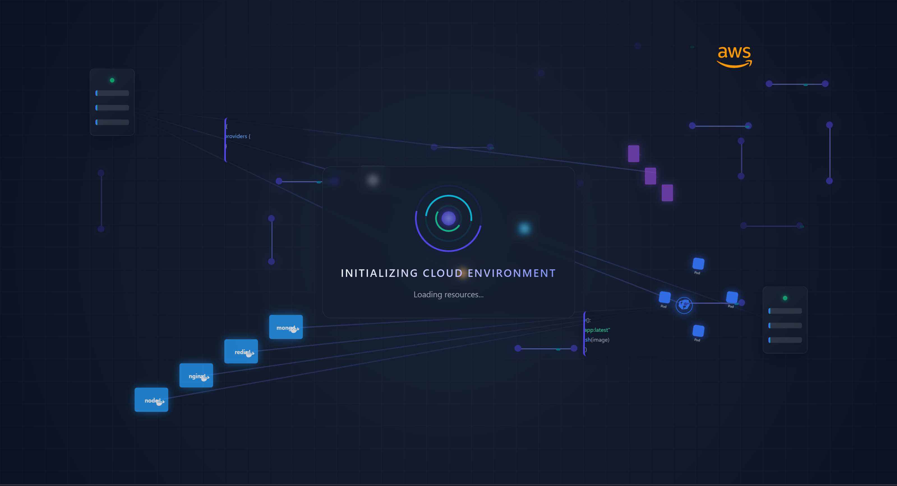

# InstantHost

Welcome to **InstantHost**, an innovative project under active development! This repository is dedicated to delivering cutting-edge features for hosting solutions. Stay tuned for regular updates and improvements.

## Project Status

This project is actively evolving, and we welcome your contributions and feedback to make it even better.

If you'd like to try the beta version of InstantHost, **check out the `without_ml` branch**. This branch contains the latest experimental features.



## How to Get Started

1. Clone the repository:
   ```bash
   git clone https://github.com/VasuBhimani/InstantHost.git
   ```

2. Switch to the `without_ml` branch to explore the beta version:
   ```bash
   git checkout without_ml
   ```

3. Follow the instructions in the documentation to set up and run the project.

## Contributions

We welcome contributions from the community! To get involved:

1. Fork the repository.
2. Create a new branch for your feature or bug fix.
3. Submit a pull request with a detailed description of your changes.

## Feedback

Have questions or suggestions? Feel free to [open an issue](https://github.com/VasuBhimani/InstantHost/issues) or contact us directly.

---

Thank you for your interest in **InstantHost**! 🚀
